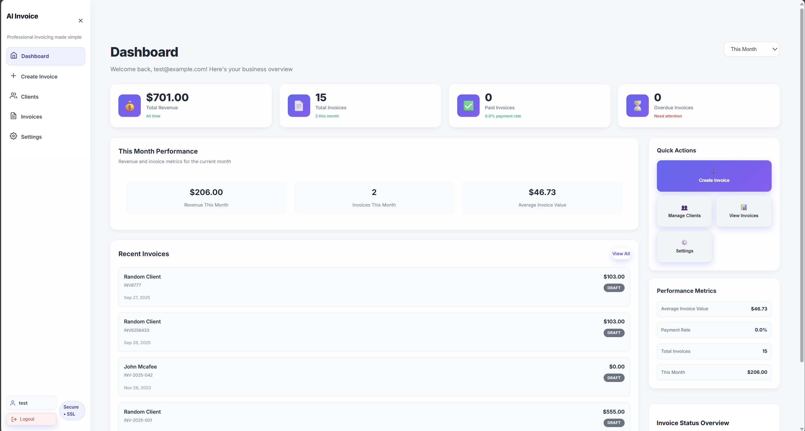
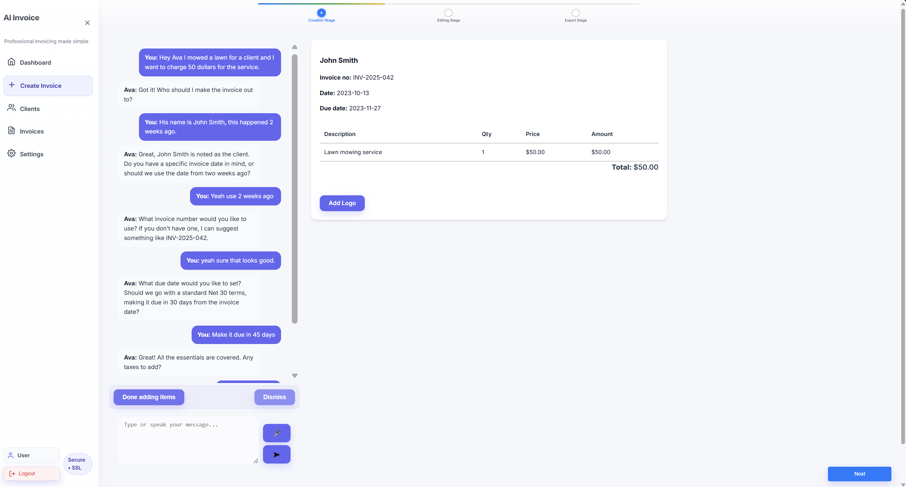

# 🧾 AI Invoice Generator

<div align="center">


**A modern, intelligent invoice management system powered by AI**

[](#)
[](https://github.com)
[](LICENSE)

</div>

---

## 📋 Table of Contents

- [Overview](#-overview)
- [Key Features](#-key-features)
- [Technology Stack](#-technology-stack)
- [Screenshots](#-screenshots)
- [Quick Start](#-quick-start)
- [Architecture](#-architecture)
- [API Documentation](#-api-documentation)
- [Deployment](#-deployment)
- [Contributing](#-contributing)
- [License](#-license)

---

## 🎯 Overview

The **AI Invoice Generator** is a cutting-edge web application that revolutionizes invoice management through artificial intelligence. Built with modern web technologies, it provides businesses with an intelligent, automated solution for creating, managing, and processing invoices with unprecedented efficiency.

### 🚀 What Makes It Special

- **AI-Powered Processing**: Leverages OpenAI's advanced language models for intelligent invoice parsing and generation
- **Real-Time Collaboration**: Multi-user support with secure authentication and role-based access
- **Modern UI/UX**: Clean, responsive design built with React and modern CSS frameworks
- **Scalable Architecture**: Microservices-based backend with PostgreSQL database
- **Export Capabilities**: Multiple export formats including PDF generation
- **Client Management**: Comprehensive client database with relationship tracking

---

## ✨ Key Features

### 🤖 AI-Powered Intelligence
- **Smart Invoice Parsing**: Automatically extract data from uploaded documents
- **Intelligent Suggestions**: AI-powered recommendations for invoice content
- **Natural Language Processing**: Convert text descriptions into structured invoice data
- **Automated Calculations**: Smart tax and total calculations

### 📊 Dashboard & Analytics
- **Real-Time Metrics**: Live dashboard with key performance indicators
- **Revenue Tracking**: Comprehensive financial analytics and reporting
- **Invoice Status Monitoring**: Visual progress tracking for all invoices
- **Client Analytics**: Detailed insights into client relationships

### 🎨 Modern User Interface
- **Responsive Design**: Optimized for desktop, tablet, and mobile devices
- **Dark/Light Mode**: Customizable theme preferences
- **Intuitive Navigation**: User-friendly interface with smooth animations
- **Accessibility**: WCAG compliant design for inclusive access

### 🔐 Enterprise Security
- **Row-Level Security**: Database-level access control with Supabase RLS
- **JWT Authentication**: Secure token-based authentication system
- **Data Encryption**: End-to-end encryption for sensitive information
- **Audit Logging**: Comprehensive activity tracking and monitoring

### 📈 Business Features
- **Client Management**: Complete CRM functionality for client relationships
- **Invoice Templates**: Customizable templates for different business needs
- **Payment Tracking**: Integrated payment status monitoring
- **Export Options**: PDF, Excel, and CSV export capabilities

---

## 🛠 Technology Stack

### Frontend
- **React 19** - Modern UI library with hooks and context
- **React Router** - Client-side routing and navigation
- **Vite** - Lightning-fast build tool and development server
- **CSS3** - Modern styling with custom components
- **React Icons** - Comprehensive icon library

### Backend
- **Node.js** - JavaScript runtime environment
- **Express.js** - Web application framework
- **Supabase** - Backend-as-a-Service with PostgreSQL
- **OpenAI API** - AI-powered text processing
- **JWT** - JSON Web Token authentication

### Database
- **PostgreSQL** - Robust relational database
- **Row Level Security** - Database-level access control
- **UUID Primary Keys** - Secure identifier generation
- **Automated Triggers** - Real-time data validation

### Development Tools
- **ESLint** - Code quality and consistency
- **Git** - Version control and collaboration
- **npm** - Package management
- **CORS** - Cross-origin resource sharing

---

## 📸 Screenshots

### Dashboard Overview

*Clean, modern dashboard with real-time metrics and quick actions*

### Invoice Generator

*Intuitive invoice creation with AI-powered suggestions*

### Invoice Editor

*Intuitive invoice editor*

### Invoice Export

*Export Invoice*

### Client Management

*Comprehensive client database with relationship tracking*

### Invoice List

*Organized invoice management with filtering and search*

### Settings Panel

*Customizable business settings and preferences*

---

## 🚀 Quick Start

### Prerequisites
- Node.js (v18 or higher)
- npm or yarn package manager
- Supabase account
- OpenAI API key

### Installation

1. **Download the source code**
   ```bash
   # Note: This is a private repository
   # Contact the project maintainer for access
   ```

1. **Install dependencies**
   ```bash
   # Install root dependencies
   npm install
   
   # Install frontend dependencies
   cd ai-invoice-generator-frontend
   npm install
   
   # Install backend dependencies
   cd ../root
   npm install
   ```

2. **Environment Setup**
   ```bash
   # Copy environment template
   cp root/env.example root/.env
   
   # Edit with your credentials
   nano root/.env
   ```

3. **Database Setup**
   - Create a new Supabase project
   - Run the SQL schema from `root/database/schema.sql`
   - Configure Row Level Security policies

4. **Start Development Servers**
   ```bash
   # Terminal 1: Start backend
   cd root
   npm start
   
   # Terminal 2: Start frontend
   cd ai-invoice-generator-frontend
   npm run dev
   ```

5. **Access the Application**
   - Frontend: `http://localhost:5173`
   - Backend API: `http://localhost:3000`

### Environment Variables

Create a `.env` file in the `root` directory:

```env
# Supabase Configuration
SUPABASE_URL=your-supabase-url
SUPABASE_ANON_KEY=your-supabase-anon-key

# OpenAI Configuration
OPENAI_API_KEY=your-openai-api-key

# Server Configuration
PORT=3000
NODE_ENV=development
```

---

## 🏗 Architecture

### System Architecture
```
┌─────────────────┐    ┌─────────────────┐    ┌─────────────────┐
│   React Frontend│    │  Express.js API │    │   Supabase DB   │
│                 │    │                 │    │                 │
│  - Components   │◄──►│  - Authentication│◄──►│  - PostgreSQL   │
│  - State Mgmt   │    │  - Business Logic│    │  - Row Level    │
│  - Routing      │    │  - AI Integration│    │    Security     │
└─────────────────┘    └─────────────────┘    └─────────────────┘
         │                       │                       │
         │                       │                       │
         ▼                       ▼                       ▼
┌─────────────────┐    ┌─────────────────┐    ┌─────────────────┐
│   User Interface│    │   OpenAI API    │    │   File Storage  │
│                 │    │                 │    │                 │
│  - Responsive   │    │  - GPT Models   │    │  - Document     │
│  - Accessible   │    │  - Text Analysis│    │    Storage      │
│  - Modern UX    │    │  - AI Processing│    │  - Media Files  │
└─────────────────┘    └─────────────────┘    └─────────────────┘
```

### Database Schema
- **Users**: User profiles and business information
- **Clients**: Client contact and relationship data
- **Invoices**: Invoice headers and metadata
- **Invoice Items**: Line items with pricing details

### Security Model
- **Authentication**: JWT-based token system
- **Authorization**: Role-based access control
- **Data Protection**: Row-level security policies
- **Input Validation**: Comprehensive request validation

---

## 📚 API Documentation

### Authentication Endpoints
- `POST /api/auth/signup` - User registration
- `POST /api/auth/signin` - User login
- `POST /api/auth/signout` - User logout
- `GET /api/auth/profile` - Get user profile
- `PUT /api/auth/profile` - Update user profile

### Client Management
- `GET /api/clients` - List all clients
- `POST /api/clients` - Create new client
- `PUT /api/clients/:id` - Update client
- `DELETE /api/clients/:id` - Delete client

### Invoice Operations
- `GET /api/invoices` - List all invoices
- `POST /api/invoices` - Create new invoice
- `PUT /api/invoices/:id` - Update invoice
- `DELETE /api/invoices/:id` - Delete invoice
- `GET /api/invoices/summary` - Dashboard summary

### AI Processing
- `POST /api/ai/parse-invoice` - Parse invoice from text
- `POST /api/ai/suggest-content` - Get AI suggestions
- `POST /api/ai/validate-data` - Validate invoice data

---

## 🚀 Deployment

### Production Deployment

1. **Environment Configuration**
   ```bash
   # Set production environment variables
   NODE_ENV=production
   SUPABASE_URL=your-production-url
   SUPABASE_ANON_KEY=your-production-key
   ```

2. **Database Migration**
   ```sql
   -- Run schema migration
   \i database/schema.sql
   ```

3. **Build and Deploy**
   ```bash
   # Build frontend
   cd ai-invoice-generator-frontend
   npm run build
   
   # Deploy backend
   cd ../root
   npm start
   ```

### Docker Deployment
```dockerfile
# Dockerfile example
FROM node:18-alpine
WORKDIR /app
COPY package*.json ./
RUN npm install
COPY . .
EXPOSE 3000
CMD ["npm", "start"]
```

### Cloud Deployment Options
- **Vercel**: Frontend deployment
- **Railway**: Backend deployment
- **Supabase**: Database hosting
- **AWS**: Full-stack deployment

---

## 🤝 Contributing

This is a private project. For access or collaboration, please contact the project maintainer.

### Development Setup
1. Contact the project maintainer for access
2. Set up your development environment
3. Follow the installation guide above
4. Make your changes
5. Submit changes for review

### Code Standards
- Follow ESLint configuration
- Write meaningful commit messages
- Add documentation for new features
- Ensure all tests pass

---

## 📄 License

This project is licensed under the MIT License - see the [LICENSE](LICENSE) file for details.

---

## 🙏 Acknowledgments

- **OpenAI** for providing powerful AI capabilities
- **Supabase** for the excellent backend-as-a-service platform
- **React Team** for the amazing frontend framework
- **Community** for feedback and contributions

---

## 📞 Support

- **Documentation**: [Full Documentation](README_DOCS.md)
- **Contact**: Please reach out to the project maintainer
- **Email**: Contact the project maintainer for support

---

<div align="center">

**Built with ❤️ by the AI Invoice Generator Team**

*This is a private project. For access or collaboration, please contact the project maintainer.*

</div>
